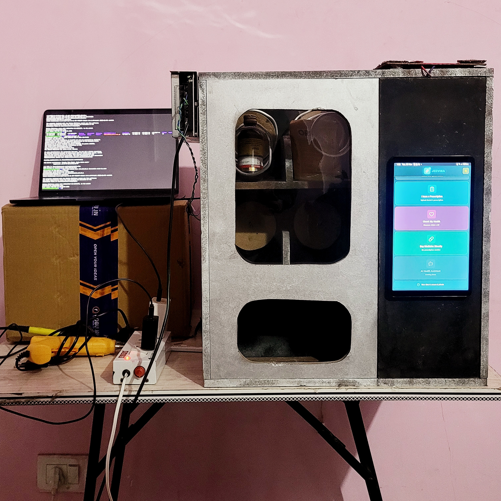
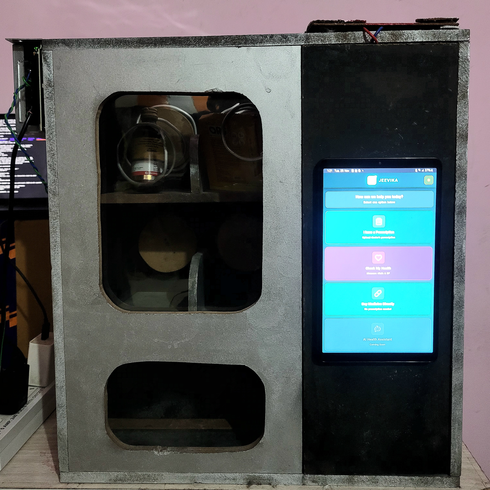
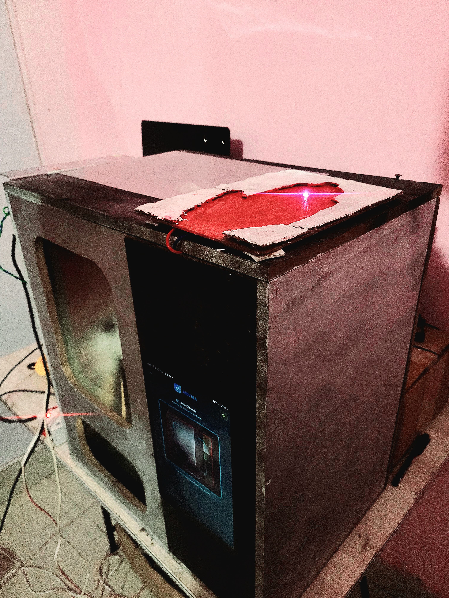
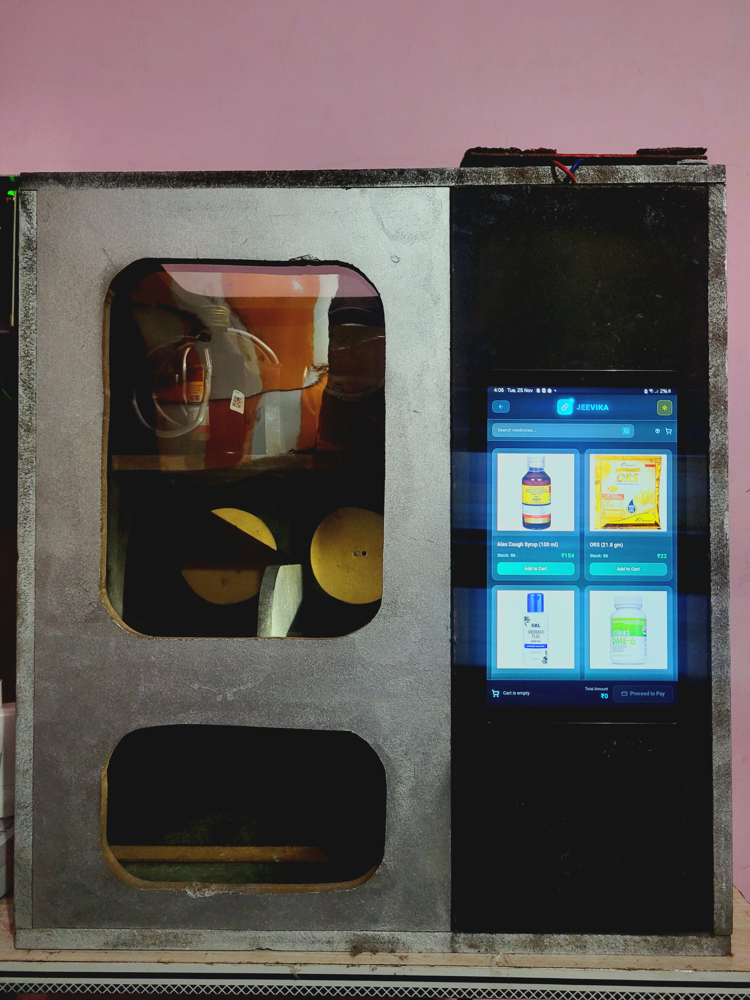
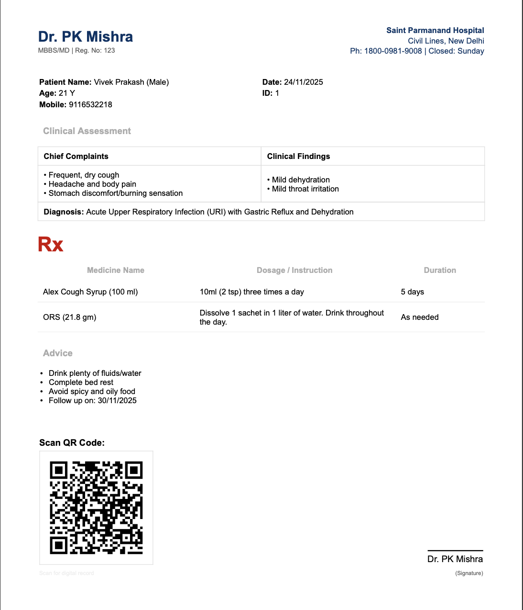
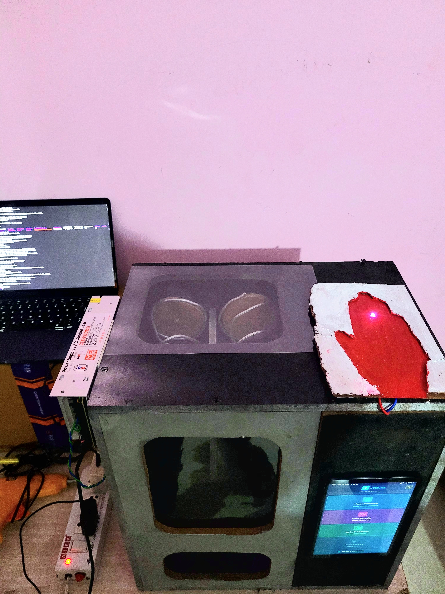

# Jeevika - Automatic Drug Dispenser

## 🏥 Revolutionizing Healthcare with Smart Medication Dispensing

<p align="center">
  
</p>

***

## 📋 Table of Contents
- [Overview](#overview)
- [Problem Statement](#problem-statement)
- [Solution](#solution)
- [Project Showcase](#project-showcase)
- [Operating Modes](#operating-modes)
- [Technology Stack](#technology-stack)
- [Features](#features)
- [Use Cases](#use-cases)
- [Business Model](#business-model)
- [Market Analysis](#market-analysis)
- [Installation](#installation)
- [Usage](#usage)
- [Future Enhancements](#future-enhancements)
- [Contributing](#contributing)

***

## 🎯 Overview

Jeevika is an innovative automatic drug dispenser designed to eliminate hospital queues and provide 24/7 access to medications. Our smart solution integrates QR code technology, IoT sensors, and secure payment systems to revolutionize healthcare accessibility.

## ❗ Problem Statement

Healthcare facilities worldwide face persistent challenges with:
- **Long hospital queues** causing physical and emotional discomfort for patients
- **Limited pharmacy hours** restricting access to essential medications
- **Medication dispensing inefficiencies** in hospitals and clinics
- **Healthcare accessibility gaps** in rural and remote areas

## 💡 Solution

Jeevika addresses these challenges through:
- **Three Operating Modes**: OTC selection, prescription-based, and health monitoring
- **QR Code Integration**: Doctors prescribe medications via web interface generating QR codes
- **Automated Dispensing**: Machine reads QR codes and dispenses prescribed medications
- **Secure Payment System**: Controlled dispensing after payment verification
- **IoT Health Monitoring**: Real-time vital sign monitoring capabilities
- **24/7 Availability**: Round-the-clock medication access

***

## 📸 Project Showcase

### The Jeevika Machine

<p align="center">
  
  <br/>
  <em>Front view showing touch display and user interface</em>
</p>

<p align="center">
  
  <br/>
  <em>Side view of the machine</em>
</p>


***

## 🎬 Operating Modes

Jeevika operates in three distinct modes to serve different healthcare needs:

### Mode 1: OTC Medicine Selection 💊
**Direct purchase of over-the-counter medications through the touch display**

[Watch the video](https://drive.google.com/file/d/1-TeVS1FZFaUATBxQzwDpIQm4ouby4S1U/view?usp=share_link)

**Working demonstration:**
- User browses available OTC medicines on touchscreen
- Selects desired medication and quantity
- Completes payment through integrated system
- Machine automatically dispenses medication to collection tray
- Transaction receipt displayed on screen

<p align="center">
  
  <br/>
  <em>OTC medicine selection screen on the dispenser</em>
</p>

***

### Mode 2: Prescription-Based Dispensing 📋
**Scan doctor's prescription QR code for automated medication dispensing**

[Watch the video](https://drive.google.com/file/d/1sxA-GS79gg-DAyGkuo7G7JvDP5l9gJkY/view?usp=share_link)

**Working demonstration:**
- User selects "Scan Prescription" option
- QR code scanned at the designated scanner area
- System verifies prescription and displays medications
- Payment processing
- Prescribed medications automatically dispensed
- Digital receipt generated

<p align="center">
  
  <br/>
  <em>Prescription Generated</em>
</p>

***

### Mode 3: Vital Signs Monitoring 🩺
**Real-time health parameter measurement and instant reporting**

[Watch the video](https://drive.google.com/file/d/1usTr3Wngn4cO28r1_s7gDqqU6iSRQS-R/view?usp=share_link)

**Working demonstration:**
- User selects "Check Vitals" from main menu
- Places palm on sensor area as guided
- Real-time measurement of body temperature, heart rate, and SpO2
- Instant health report displayed on screen
- Option to save or print health report

**Measured Parameters:**
- 🌡️ **Body Temperature**: Non-contact infrared measurement
- 💓 **Heart Rate**: Real-time pulse detection  
- 🫁 **Oxygen Saturation (SpO2)**: Blood oxygen level monitoring

<p align="center">
  
  <br/>
  <em>Health monitoring interface showing real-time measurements</em>
</p>

***

## 🛠️ Technology Stack

### **Backend & Database**
- **Database**: PostgreSQL
- **Backend**: Node.js with Express
- **API**: RESTful architecture

### **Frontend**
- **Languages**: HTML, CSS, JavaScript, Tailwind CSS
- **FrameWork**: Reactjs
- **Interface**: Touch-enabled responsive web interface
- **Display**: HD touchscreen 

### **Hardware & IoT**
- **Controller**: Raspberry Pi 4
- **Display**: Touch-enabled LCD screen (7"/10")
- **QR Scanner**: High-speed barcode/QR reader module
- **Dispensing Mechanism**: Stepper motor controlled compartment system
- **Power**: Mains with UPS backup for 24/7 operation

### **Sensors**
- **MLX90614**: Non-contact infrared thermometer
- **MAX30102**: Pulse oximeter and heart rate sensor
- **Future**: Blood glucose measurement module

## ✨ Features

- 🔒 **Secure Medication Storage**: Multiple compartments with controlled access
- 📊 **Real-time Health Monitoring**: Multi-parameter vital signs tracking
- 💳 **Payment Integration**: Secure transaction processing (UPI/Card/Cash)
- 👨‍⚕️ **Doctor Prescription System**: Web-based prescription generation with QR codes
- ⚡ **24/7 Operation**: Continuous availability with battery backup
- 📍 **Multi-location Deployment**: Suitable for hospitals, clinics, public spaces
- 📱 **User-Friendly Interface**: Intuitive touchscreen navigation with visual guides
- 📈 **Inventory Management**: Real-time stock tracking and automated alerts
- 🔔 **Alert System**: Low stock notifications and maintenance reminders


## 🎯 Use Cases

### **Healthcare Facilities**
- **Hospitals & Clinics**: Streamline medication dispensing, reduce waiting times
- **Pharmacy Enhancement**: Extended 24/7 service capability
- **Emergency Departments**: Quick access to essential medications

### **Public & Remote Access**
- **Rural Areas**: Bridge healthcare gaps in underserved regions
- **Public Spaces**: Airports, railway stations, shopping malls for emergency needs
- **Highway Safety**: Emergency first-aid dispensing for accident response
- **Educational Institutions**: Campus health centers and hostels

### **Specialized Applications**
- **Women's Health**: Menstrual hygiene product dispensing
- **Emergency Response**: First-aid kit and essential medicine distribution
- **Workplace Wellness**: Corporate health initiatives and employee care

## 💼 Business Model

### **Revenue Streams**
- Retail medication sales (primary revenue - 60%)
- Healthcare facility subscription services (20%)
- Per-prescription revenue sharing with doctors (10%)
- Health data analytics services (5%)
- Advertising and pharmaceutical partnerships (5%)

### **Financial Projections**
- **Gross Profit Margin**: 50%
- **Net Profit Margin**: 20%
- **Manufacturing Cost**: ₹1,50,000 per unit (estimated)
- **Average Daily Revenue**: ₹3,000-5,000 per unit
- **Break-even Period**: 12-18 months per installation
- **ROI**: 2-3 years per unit

## 📊 Market Analysis

### **Global Market**
- **Automatic Pill Dispenser Market**: USD 2.7 billion (2022)
- **Growth Rate**: 8.4% CAGR (2023-2032)
- **Projected Market**: USD 5.8 billion (2032)
- **Pharmaceuticals Market**: USD 209.85 billion (2021) → USD 352.98 billion (2030)

### **Indian Market**
- **Current Pharmaceutical Market**: USD 41 billion (2021)
- **Projected Growth**: USD 65 billion (2024) → USD 130 billion (2030)
- **Healthcare Automation**: Emerging segment with high growth potential
- **Target Segments**: Urban hospitals, rural health centers, corporate offices, public spaces

## 🚀 Installation

### Prerequisites
- Raspberry Pi 4 (4GB+ RAM recommended)
- PostgreSQL Server
- Node.js v16+ and npm
- Python 3.8+ (for sensor interfacing)
- Touch-enabled display (HDMI compatible)

### Hardware Setup
```


# Connect sensors to Raspberry Pi GPIO pins

# MLX90614: I2C interface 

# MAX30102: I2C interface 

# QR Scanner: USB connection

# Stepper motors: GPIO pins as per hardware configuration

# Touch display: HDMI + USB for touch input

```

## 📱 Usage

### For Patients

#### **Mode 1: OTC Purchase**
1. Tap the display to wake up the system
2. Select "Buy Medicine" from the home screen
3. Browse available medicines by category or search
4. Select medicine and required quantity
5. Review cart and proceed to payment
6. Complete payment (UPI/Card/Cash)
7. Collect dispensed medication from collection tray

#### **Mode 2: Prescription Mode**
1. Obtain prescription QR code from your doctor (digital or printed)
2. Tap "Scan Prescription" on the home screen
3. Hold QR code steady in front of the scanner
4. Wait for verification (2-3 seconds)
5. Review prescribed medicines and total cost
6. Complete payment
7. Collect all medications from collection tray

#### **Mode 3: Health Check**
1. Tap "Check Vitals" on the home screen
2. Read on-screen instructions carefully
3. Place palm flat on the designated sensor area
4. Keep hand still for 10-15 seconds during measurement
5. View complete health report with all parameters

### For Healthcare Providers (Doctors)

#### **Creating Prescriptions**
1. Log in to Jeevika doctor portal (web interface)
2. Enter or search patient details
3. Add patient diagnosis and symptoms
4. Select prescribed medications from verified database
5. Specify dosage, frequency, and duration
6. Add special instructions if needed
7. Generate secure QR code prescription
8. Share QR code with patient (print, SMS, email, or WhatsApp)
9. Track prescription fulfillment status

### For Administrators

#### **Inventory Management**
1. Log in to admin dashboard
2. Monitor real-time stock levels
3. Receive low-stock alerts
4. Update inventory after refilling
5. View sales analytics and transaction history
6. Manage pricing and promotions
7. Access system health and diagnostics

***

## 🔮 Future Enhancements

- [ ] **Blood Glucose Monitoring**: Integration of glucometer for diabetes patients
- [ ] **AI Health Recommendations**: Personalized OTC suggestions based on vitals
- [ ] **Telemedicine Integration**: Direct video consultation with doctors
- [ ] **Multi-language Support**: Hindi, Tamil, Telugu, Bengali, and regional languages
- [ ] **Mobile App**: Patient app for prescription management and health tracking
- [ ] **Facial Recognition**: Biometric verification for prescription pickup
- [ ] **Cold Chain Monitoring**: Temperature tracking for sensitive medications
- [ ] **ABHA Integration**: Link with Ayushman Bharat Health Account
- [ ] **Voice Assistant**: Voice-guided interface for accessibility
- [ ] **Predictive Analytics**: Inventory forecasting and demand prediction
- [ ] **Blockchain**: Secure prescription and health record management

***

## 🤝 Contributing

Contributions are welcome **only from approved collaborators**.

If you wish to contribute, please contact the project owner first.
Unauthorized forks, copies, or pull requests are not permitted due to the
project's proprietary nature.

Approved contributors may follow the internal development workflow.

***

## 📄 License

Copyright (c) 2025 Vivek Prakash.  
All rights reserved.

This software, hardware design, documentation, and associated files are the
intellectual property of the author.

No part of this project may be copied, modified, distributed, or used in any
form without explicit written permission from the owner.

Commercial use is strictly prohibited.

***


***

<p align="center">
  <strong>Jeevika - Making Healthcare Accessible, Anytime, Anywhere</strong><br/>
  Made with ❤️ for better healthcare accessibility in India
</p>

